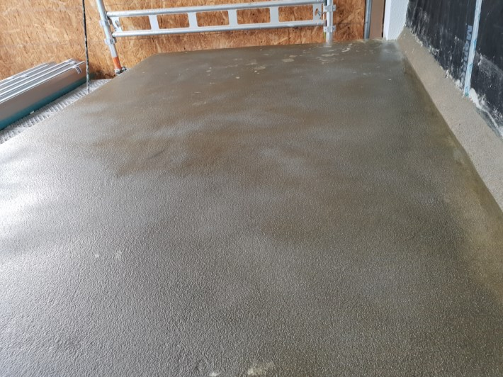
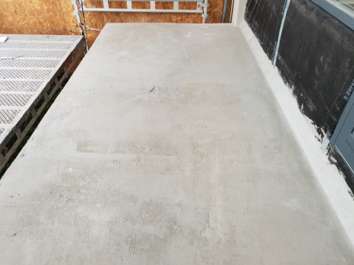
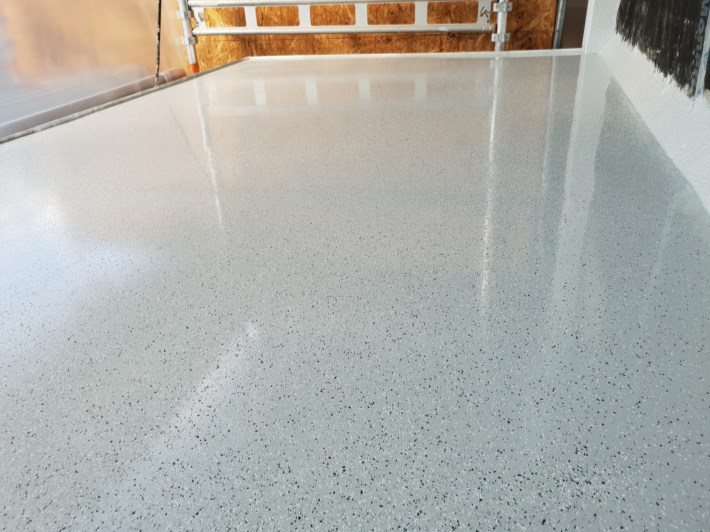
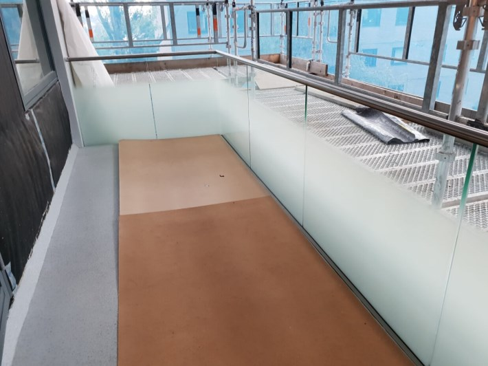
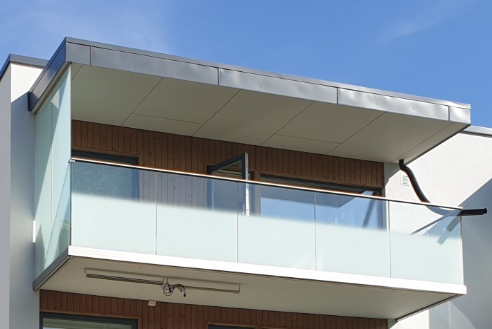
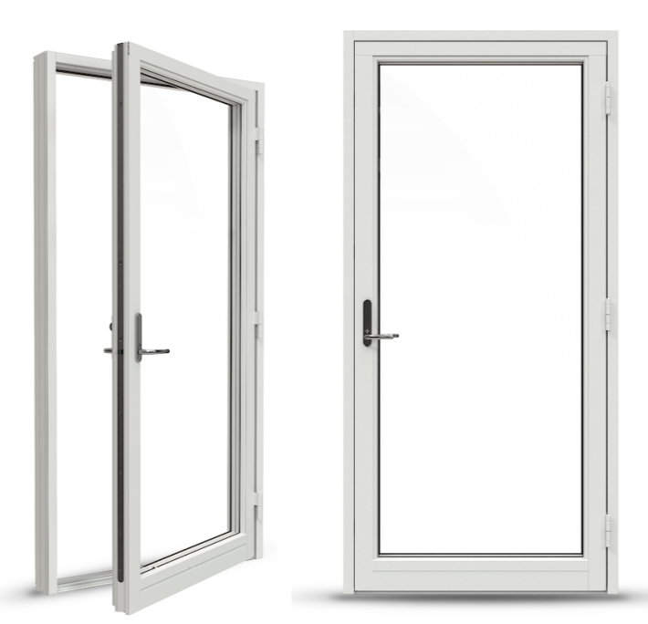

Som del av forberedelsene til prosjektet ble tilstanden til balkongene nøye vurdert. Konklusjonen var at balkongene ikke måtte rives, men at de måtte renoveres.

## Balkonggulv

Betongen ble pusset og rettet før det ble lagt StoPur EB 200 polyuretanbelegg for balkonger.

Balkongtaket ble også malt hvitt.

### Vask og vedlikehold av belegget

Rengjøring utføres regelmessig avhengig av hvor fort gulvet blir nedsmusset.

Løs smuss fjernes med støvsuger eller kost/feiebrett. 

Tilsett det nøytrale rengjøringsmiddelet StoDivers IF i vaskevannet. Gjenværende smuss må skures bort med en myk børste eller svamp.

Andre typer rengjøringsmidler, som aceton, rødsprit og tynner, skal ikke brukes uten godkjenning fra Sto Norge AS. Skarpe gjenstander, som kniv, sparkel eller lignende, må heller ikke brukes ved rengjøring. Det kan skade belegget.
  
Kontakt Sto Norge AS for råd om utbedring av skader. Belegget skal bare overmales i samråd med Sto Norge AS.
 
Belegget skal ikke dekkes med fliser. Det anbefales å bruke møbelknotter under balkongmøblene.

Les mer i vedlagte brosjyre.

## Balkongrekkverk

Rekkverket som ble valgt, er Færder II. Høyden varierer mellom balkongene. I første til tredje etasje i lavblokkene er høyden 100 cm, mens den er 120 cm i fjerde etasje. Det er tilsvarende forskjeller i nr. 68 og 84. Det var ikke avklart ved hvilken etasje skillet skulle gå.

I første etasje i lavblokkene er glasset frostet i full høyde. I de øvrige etasjene er de nederste 80 cm frostet, som vist på bildet.

Det er ikke tillatt å henge noe, for eksempel blomsterkasser, på selve rekkverket. Leverandøren opplyser at garantien kan bortfalle dersom belastning på håndløperen fører til skade eller at glasset krakelerer.

## Balkongtak toppetasjer

På balkongene som ligger i toppetasjen bygges det nytt tak i treverk. Dette gir en stor forbedring sammenlignet med bølgeblikktakene man hadde før. Bildet nedenfor viser taket.

## Balkongdører

Alle balkongdørene ble skiftet ut med NorDan ND NTech Villa sikkerhetsdør.

Totalt ble 250 slike dører skiftet ut. Dørene slår utover og er hengslet som tidligere, til venstre eller høyre avhengig av plasseringen i forhold til stuevinduene.

Størrelsen på dørene er den samme som før. Dørene i nr. 68 er derfor bredere enn dørene i de andre blokkene.

{}
