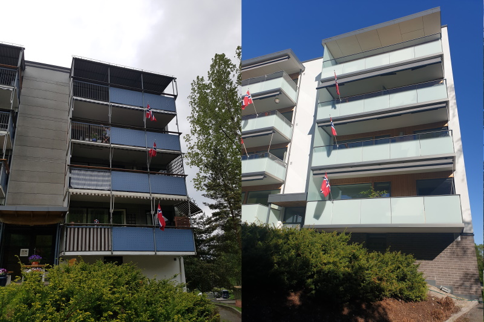
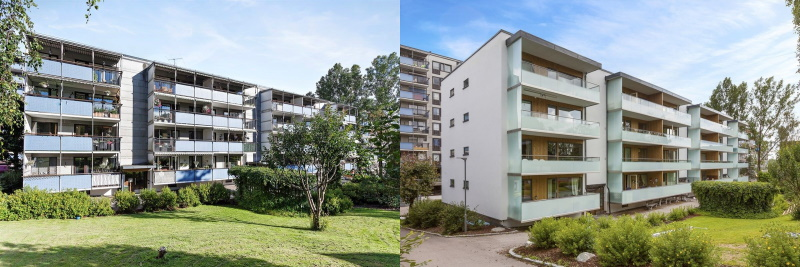
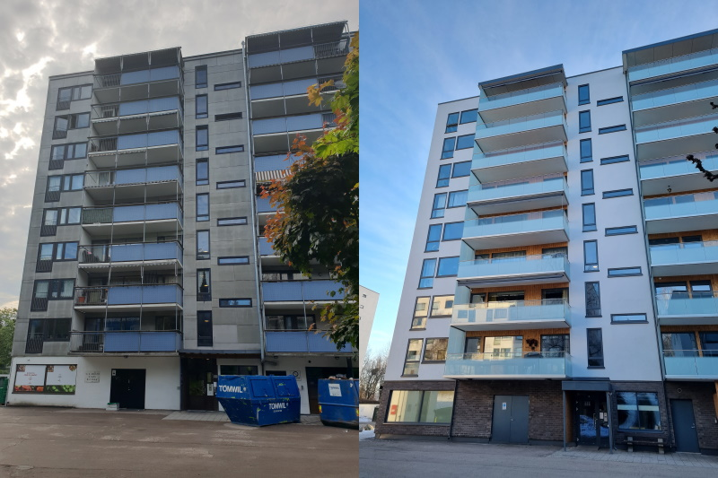
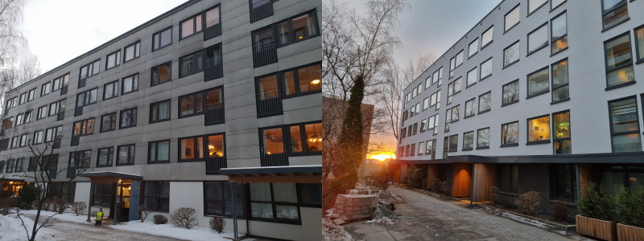
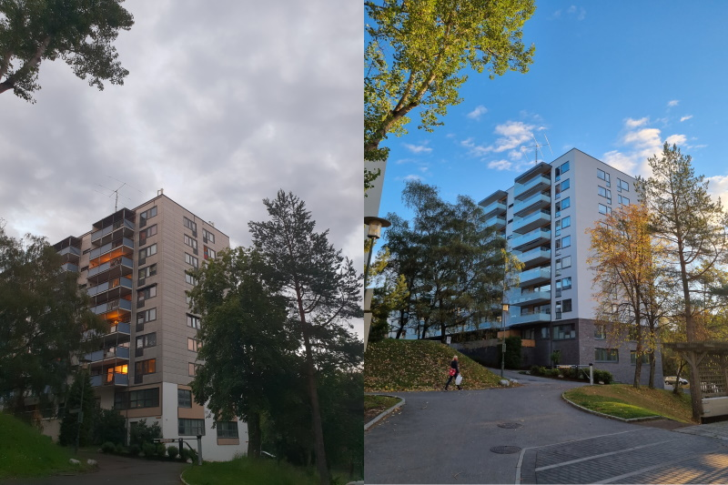
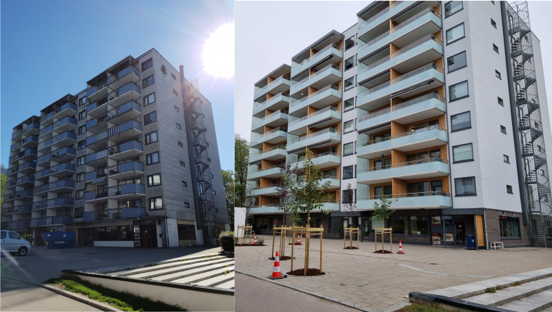
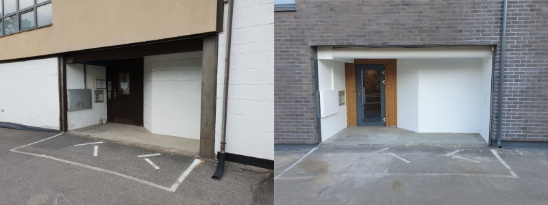
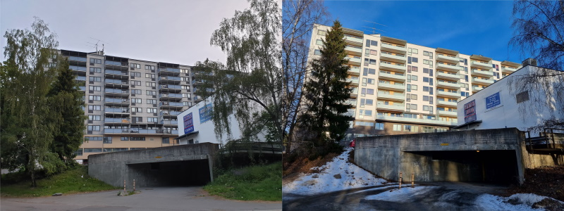

<!-- markdownlint-disable MD033 -->

<figur>
    
    <figcaption><h4>Før og etter</h4></figcaption>
</figur>

<figur>
    
    <figcaption><h4>Før og etter</h4></figcaption>
</figur>

<figur>
    
    <figcaption><h4>Før og etter</h4></figcaption>
</figur>

<figur>
    
    <figcaption><h4>Før og etter</h4></figcaption>
</figur>

<figur>
    
    <figcaption><h4>Før og etter</h4></figcaption>
</figur>

<figur>
    
    <figcaption><h4>Før og etter</h4></figcaption>
</figur>

<figur>
    
    <figcaption><h4>Før og etter</h4></figcaption>
</figur>

<figur>
    
    <figcaption><h4>Før og etter</h4></figcaption>
</figur>

<figur>
    
    <figcaption><h4>Før og etter</h4></figcaption>
</figur>

<figur>
    
    <figcaption><h4>Før og etter</h4></figcaption>
</figur>

<figur>
    
    <figcaption><h4>Før og etter</h4></figcaption>
</figur>

<figur>
    
    <figcaption><h4>Før og etter</h4></figcaption>
</figur>

<figur>
    
    <figcaption><h4>Før og etter</h4></figcaption>
</figur>

<figur>
    
    <figcaption><h4>Før og etter</h4></figcaption>
</figur>

<figur>
    
    <figcaption><h4>Før og etter</h4></figcaption>
</figur>

<figur>
    
    <figcaption><h4>Før og etter</h4></figcaption>
</figur>

{}
