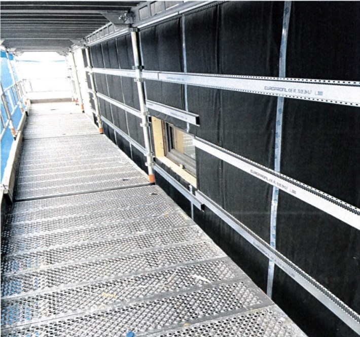
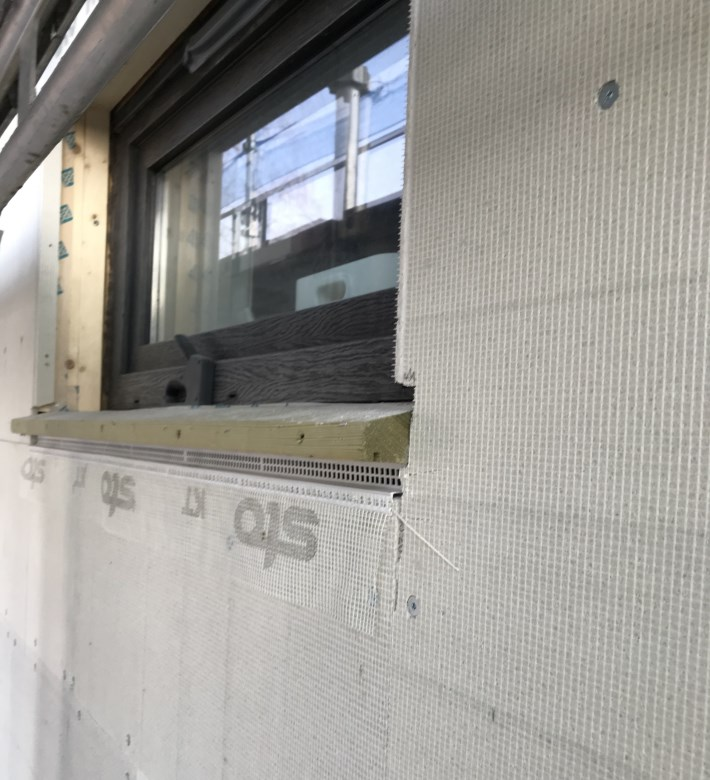
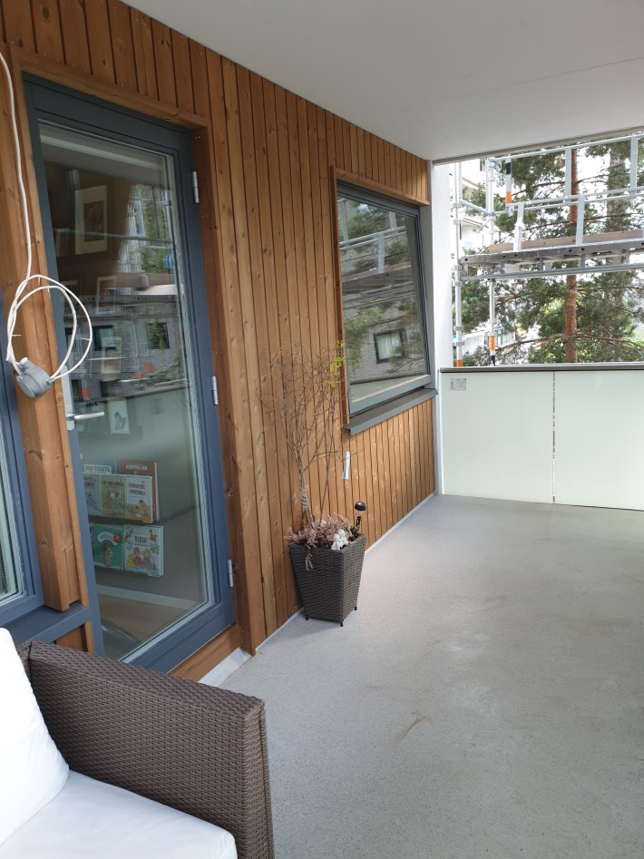

Arbeidet av fasaden er litt forskjellig mellom vegg på balkongside og andre vegger

Arbeid fasade utenom balkongvegg

Følgende blir gjort med fasadene.

1. Dagens plater med asbest fjernes

2. Det lektres ut 10 cm

3. Det legges ny isolasjon utenpå dagens isolasjon. Områder hvor eventuell isolasjon er dårlig vil den erstattes. 

4. Det legges vindperre utenpå isolasjon samt skinner for feste av STO plater

5. Det legges sto plater utenpå.

6. Det legges puss utenpå  STO platene.

Fasade Balkong

På balkongsiden fores det ikke ut tilsvarende som på de andre sidene. Her forest det ut ca 5 cm og så erstattes isolasjonen med en ekstra god en.

Dette gjør at man ikke mister så mye plass på balkongen.

 

{}
