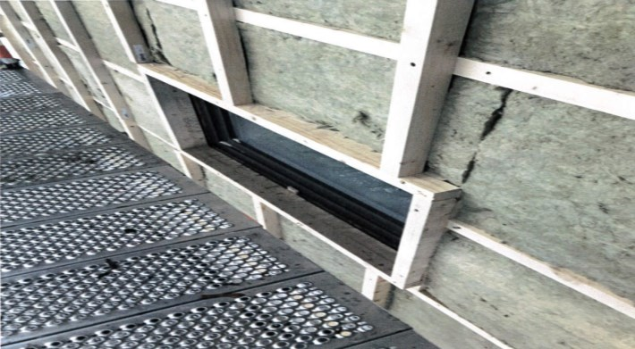
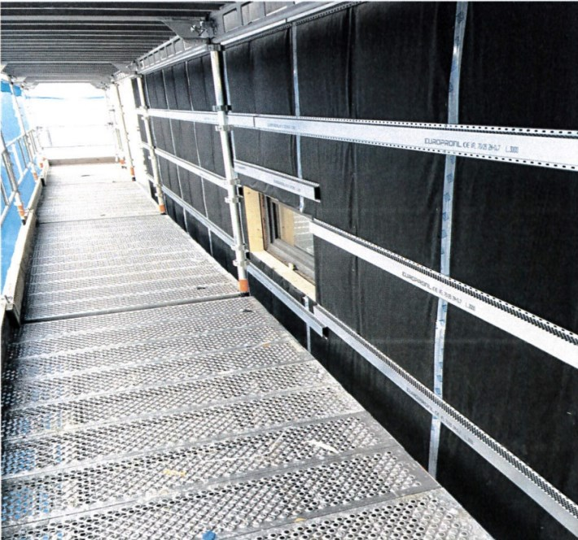
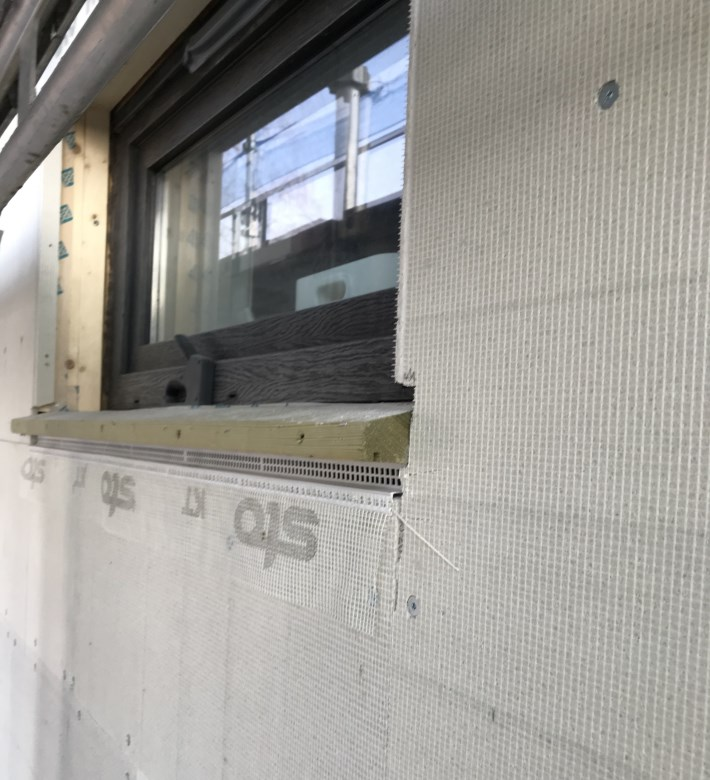
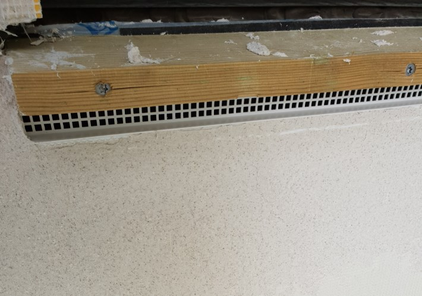
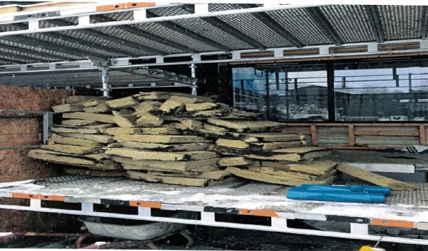
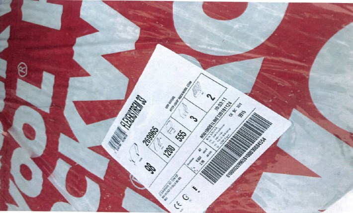
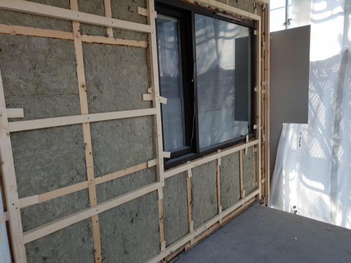
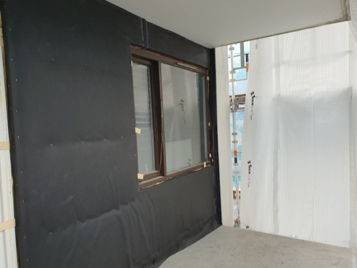
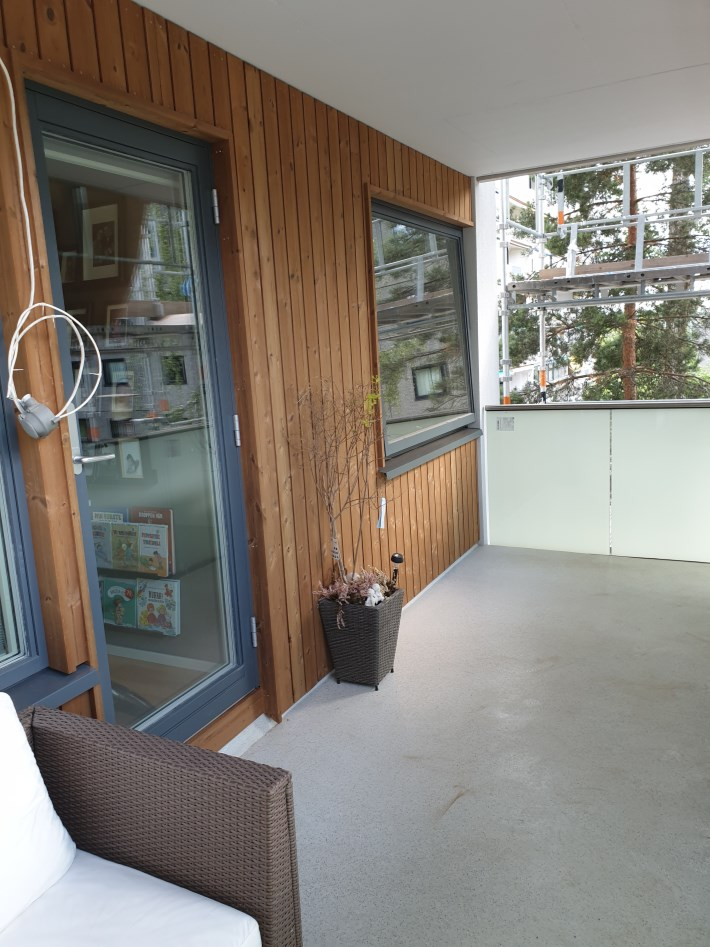

Arbeidet på balkongveggen skilte seg noe fra arbeidet på de øvrige veggene.

## Fasader utenom balkongveggen

Følgende ble gjort med fasadene:

1. Dagens plater med asbest fjernes

2. Det lektres ut 10 cm

3. Det legges ny isolasjon utenpå den eksisterende isolasjonen. Eksisterende isolasjon i dårlig stand erstattes.

4. Det legges vindsperre utenpå isolasjonen og skinner for montering av Sto-plater.

5. Sto-plater monteres utenpå.

6. Sto-platene pusses.

## Balkongfasaden

På balkongsiden ble veggen ikke fôret ut like mye som på de andre sidene. Her ble den fôret ut ca. 5 cm, og isolasjonen ble erstattet med en type med bedre isolasjonsevne.

Dette begrenser tapet av plass på balkongen.

 

{}
