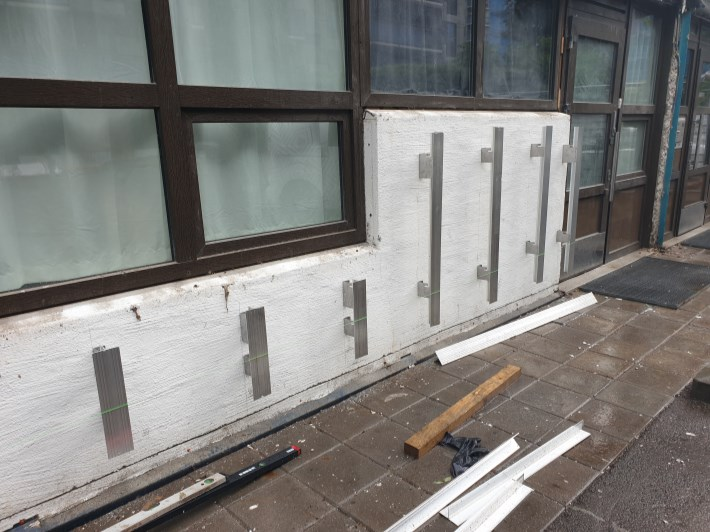
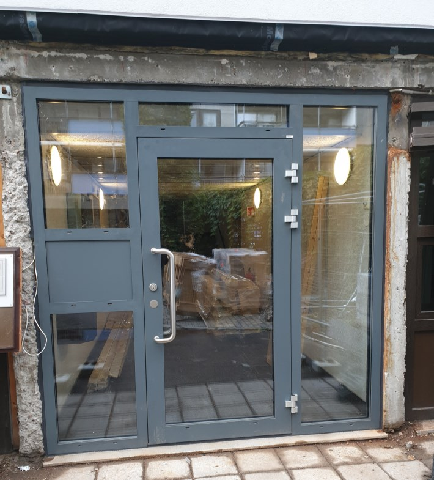

Alle blokkene fikk nytt inngangsparti og nye inngangsdører. 

## Murvegg

Også murveggene i sokkeletasjen ble etterisolert. Det ble satt opp beslag og nye plater med isolasjon mellom mur og plater.

 

Utenpå den nye isolasjonen ble det lagt plater og deretter Sto Bricks.

## Inngangsparti

Alle inngangsdører i borettslaget ble byttet ut og det ble bygget nye tak over inngangspartiene der det var mulig.

{}
