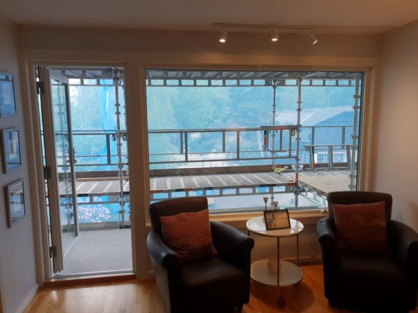
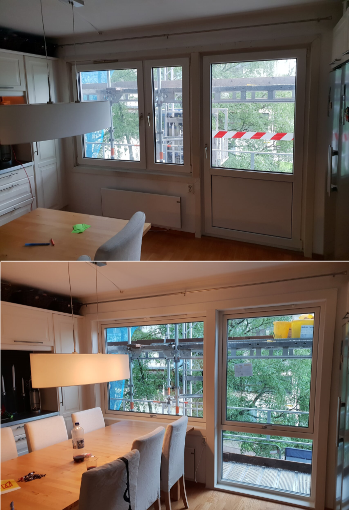

Alle vinduer ble erstattet. Totalt vil 1283 vinduer ble byttet ut.

### Stuevindu (gjelder de fleste leilighetene)

De to stuevinduene bke erstattet av et NorDan ND NTech Fast karm vindu på 2368 x 1638 mm

Størrelsen mellom foring etter montering er ca 2354 x 1548 mm. Dette er relevant hvis man skal ha gardiner på innsiden av foringen. 

### Soverromsvindu og kjøkkenvindu

I dag har soverromsvinduene og kjøkkenvinduene et stort vindu og et lite vindu. Disse erstattes av et vindu med en glassflate. Størrelsen på disse vinduene er 1668 x 1368 og er av typen Jordan ND NTech Toppsving. Totalt 536 slike vinduer blir byttet ut.  

Størrelsen inni foringen er ca 1653 x 1353mm. Dette er relevant hvis man skal ha gardiner som skal monteres inni foringen.  

### Fransk balkong

Den franske balkongen vil erstattes av et vindu med en fast del og en del som åpnes.  Det delte vinduet byttes i stort utadslående.

Typen er av Jordan ND NTech Villa Fast Karm

Bildet nedenfor viser før og etter bytte på kjøkken.

## Informasjon om Dugging

Vinduene vil erstattes med moderne vinduer med lavt varmetap som vil redusere behovet for varme innvending. De er såpass gode på dette at man i noen tilfeller vil få dugg på utsiden av vinduene. Les mer om dette her. 

{}
