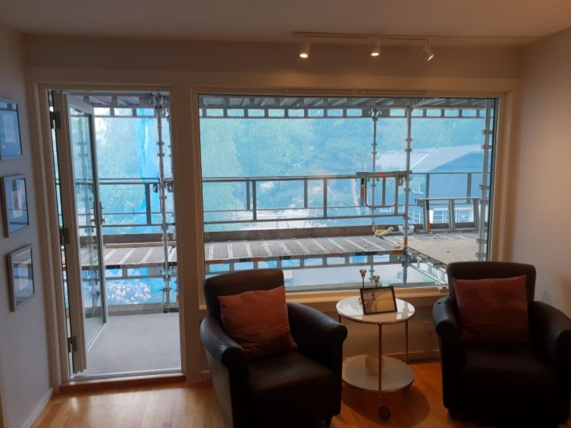
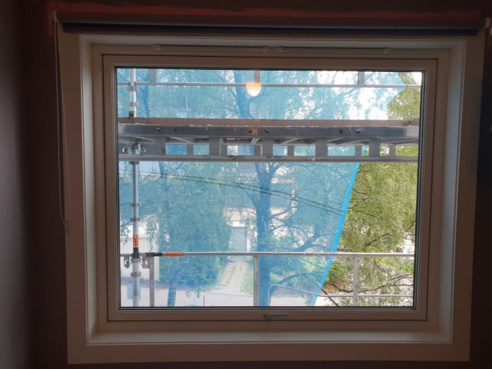
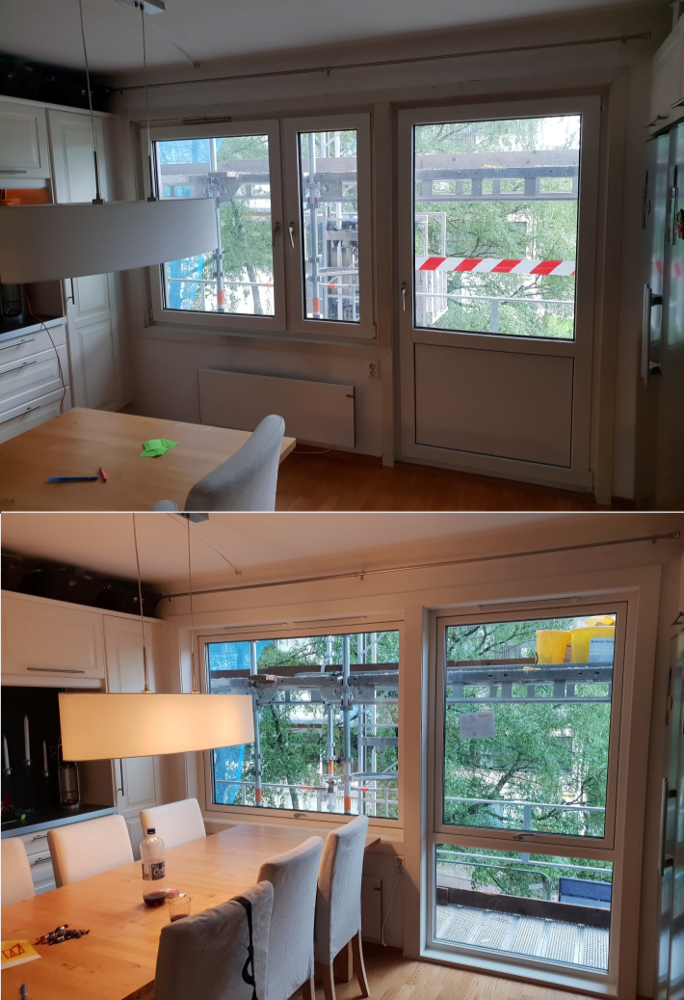

Alle vinduene ble erstattet. Totalt ble 1 283 vinduer skiftet ut.

### Stuevinduer (gjelder de fleste leilighetene)

De to stuevinduene ble erstattet av ett NorDan ND NTech-vindu med fast karm, med målene 2 368 × 1 638 mm.

Målet mellom fôringene etter montering er ca. 2 354 × 1 548 mm. Dette er relevant ved montering av gardiner på innsiden av fôringen.

### Soveromsvindu og kjøkkenvindu

Soveroms- og kjøkkenvinduene besto tidligere av ett stort og ett lite vindu. De ble erstattet av et vindu med én glassflate. Vinduene måler 1 668 × 1 368 mm og er av typen NorDan ND NTech Toppsving. Totalt ble 536 slike vinduer skiftet ut.

Målet på innsiden av fôringen er ca. 1 653 × 1 353 mm. Dette er relevant ved montering av gardiner i fôringen.

### Fransk balkong

Den franske balkongen ble erstattet av et vindu med én fast og én åpningsbar del. Det delte vinduet ble erstattet av et stort, utadslående vindu.

Vinduet er av typen NorDan ND NTech Villa Fast karm.

Bildet nedenfor viser før og etter bytte på kjøkken.

## Informasjon om dugging

Vinduene ble erstattet med moderne vinduer med lavt varmetap, noe som reduserer oppvarmingsbehovet. Isolasjonsevnen er så god at det i noen tilfeller kan oppstå dugg på utsiden av vinduene.

{}
