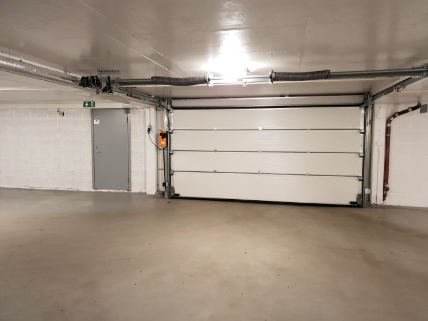
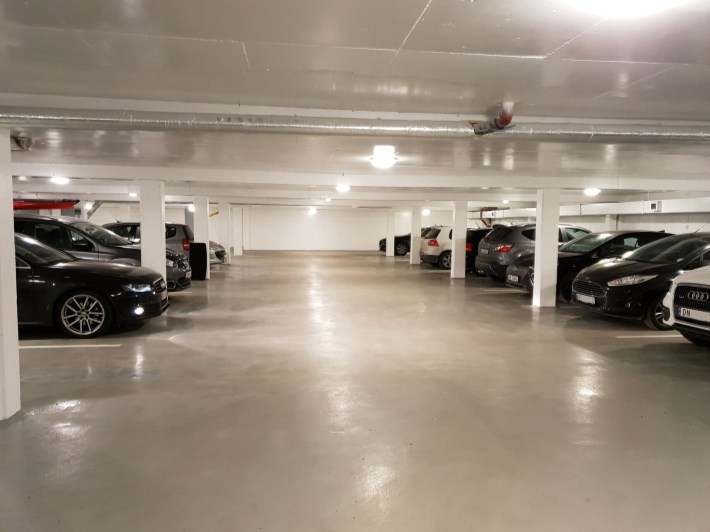

Borettslaget overtok garasjene i Hovseterveien 70  juni 2018 fra Stor Oslo Eiendom.

Totalt er det 157 parkeringsplasser som ble overtatt. Disse er fordelt over 3 plan. U1, U2 og U3.

I sammenheng med kjøp og overtakelse ble det gjennomført en større oppussing av garasjene. Det hadde ikke vært gjort noe siden de ble bygget i 1975.

Sommeren 2019 ble det etablert et moderne elbil ladeanlegg i garasjene. Alle 157 plassene har fått tilrettelegging for ladeboks og de som ønsker har fått montert ladeboks.

## Finansiering

Borettslaget har tatt opp et lån på ca 32.000.000 for å oppgradere og kjøpe parkeringsplassene. Denne gjelden fordeles likt utover de leilighetene som har parkeringsplass.  Se mer informasjon om [fellesgjeld](../../forowners/finance/).

{}
