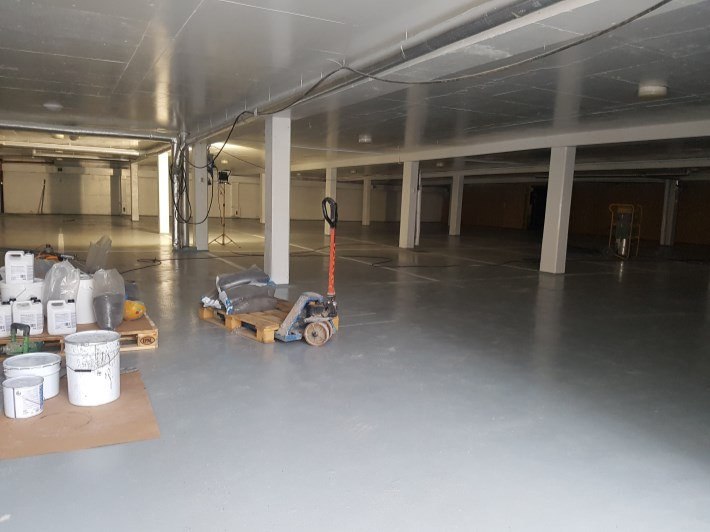
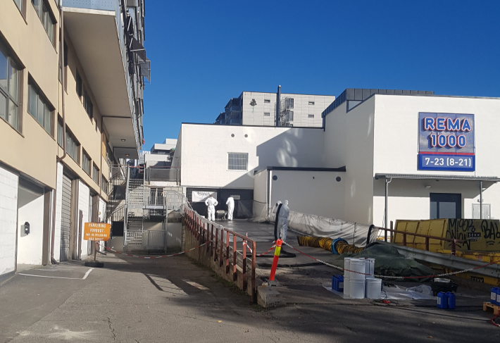
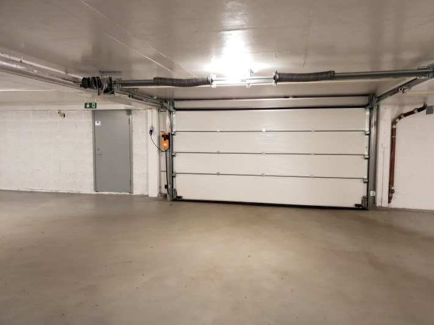
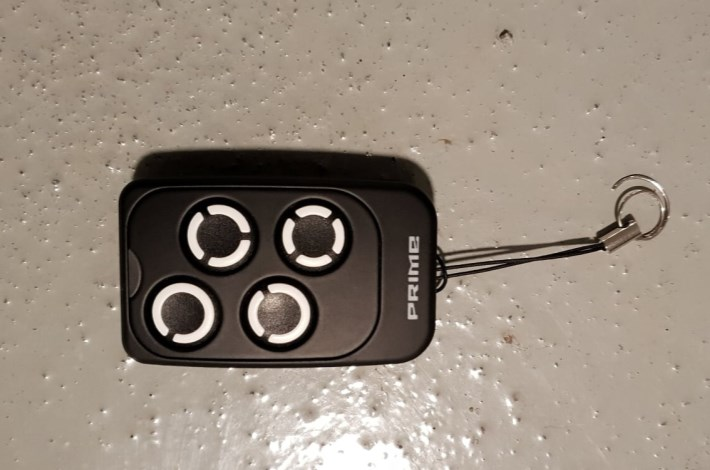
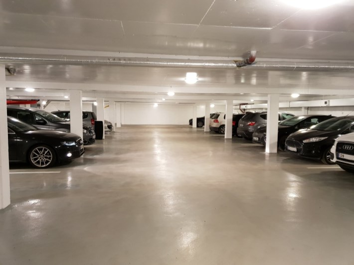

Borettslaget overtok garasjene i Hovseterveien 70 fra Stor Oslo Eiendom i juni 2018.

Totalt ble 157 parkeringsplasser overtatt. De er fordelt på tre plan: U1, U2 og U3.

I forbindelse med kjøpet og overtakelsen ble garasjene grundig pusset opp. Det var ikke gjennomført større arbeider siden de ble bygget i 1975.

Sommeren 2019 ble det etablert et moderne ladeanlegg for elbiler i garasjene. Alle de 157 plassene er tilrettelagt for ladeboks, og de som ønsket det, fikk montert en ladeboks.

## Finansiering

Borettslaget tok opp et lån på ca. 32 000 000 kroner for å kjøpe og oppgradere parkeringsplassene. Gjelden fordeles likt mellom leilighetene som har parkeringsplass. Se mer informasjon om [fellesgjeld](../../forowners/finance/).

{}
