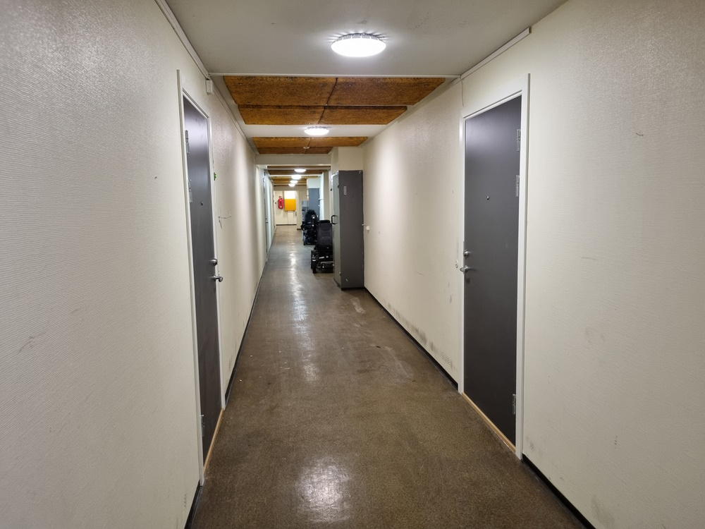
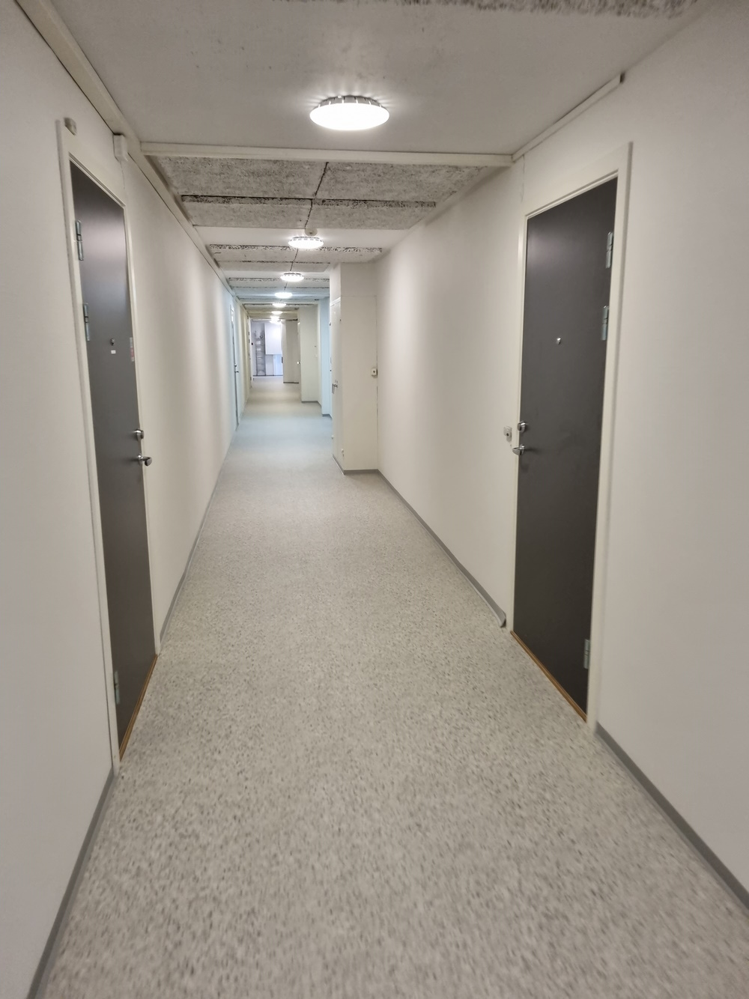
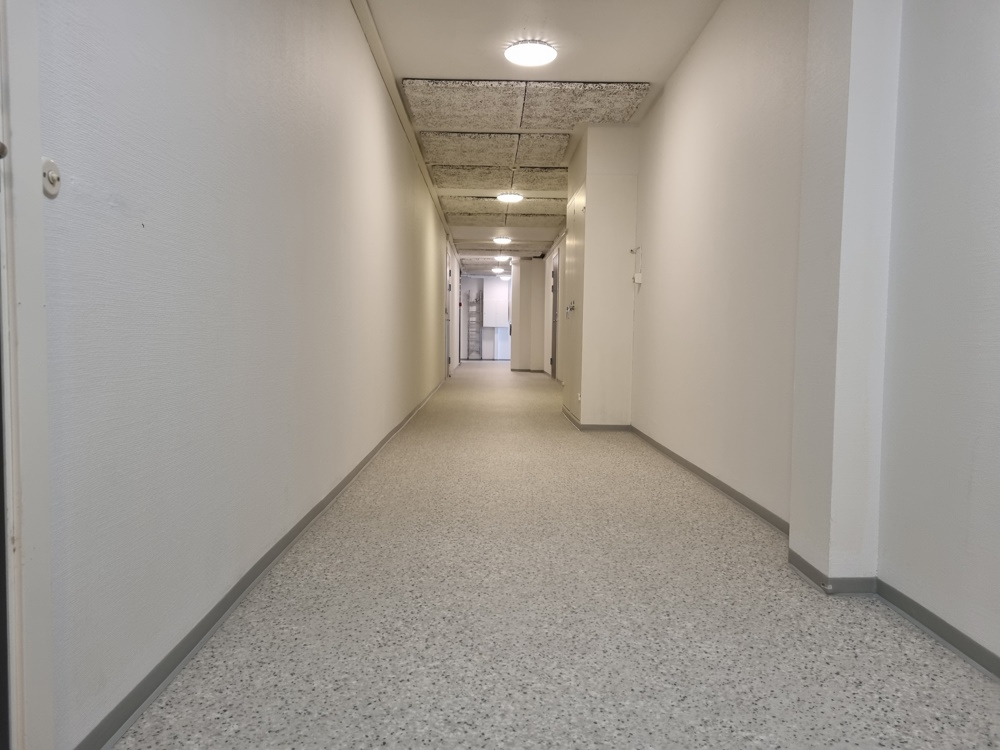
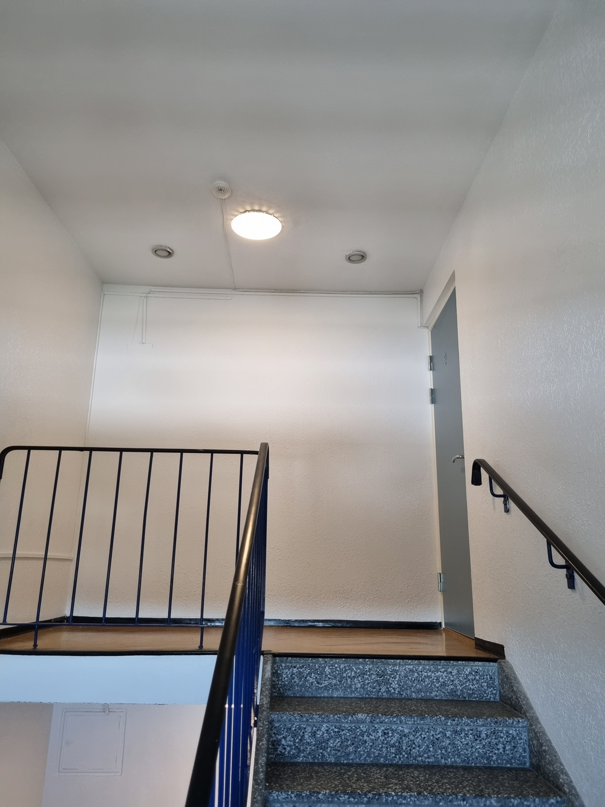

Arbeidet omfattet sparkling og maling samt nytt laminatgulv.

Da arbeidet viste seg vanskelig å gjennomføre på dugnad, ble det inngått en avtale med Front om å male gangene i nr. 68 og 84 og legge nytt laminatgulv.

### Før

### Etter 

Trappeløpene i nr. 68 og 84 ble malt.

{}
