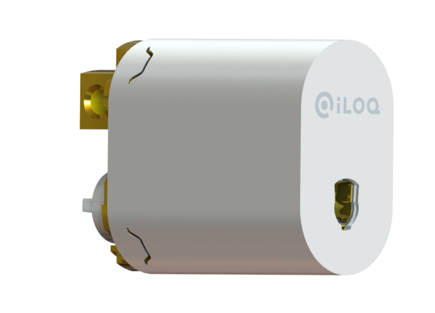
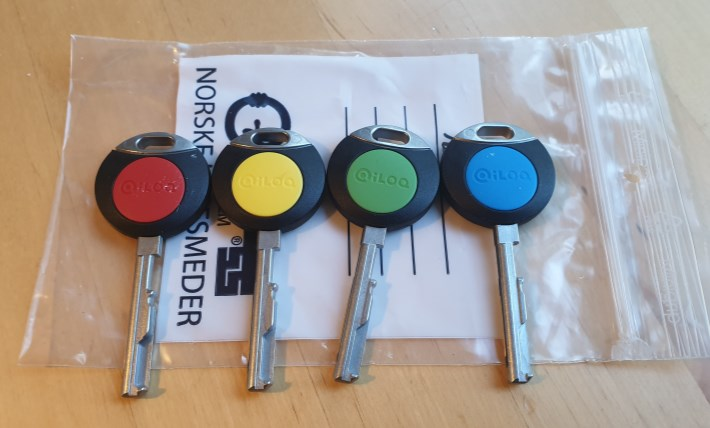

Bakgrunnen var at det gamle låsesystemet ikke lenger var beskyttet mot kopiering av nøkler. Styret kunne derfor ikke med sikkerhet vite hvem som hadde nøkler til fellesområdene og garasjene.

For å redusere risikoen ved tapte nøkler hentet styret inn tilbud på både tradisjonelle og elektroniske låsesystemer. Elektroniske systemer gjør det mulig å sperre nøkler som er mistet.

Den elektroniske løsningen er dyrere, men hindrer at hele systemet blir usikkert når noen mister en nøkkel.

Det vil også gjøre det mye enklere å endre på tilgangsrettigheter for en beboer.

Etter å ha hentet inn tilbud fra flere leverandører valgte styret iLOQ S10-systemet, med Låssenteret AS som leverandør. Systemet er blant annet batteriløst og kan monteres i de eksisterende dørene, som boddørene.

Omtrent 120 låser i ca. 110 dører ble skiftet ut. Låsene ble byttet samtidig med dørene i hver blokk. Leilighetene fikk utdelt nye nøkler. Hver leilighet fikk like mange nøkler som antall rom: fireromsleiligheter fikk fire, treromsleiligheter fikk tre, og ett- og toromsleiligheter fikk to.

Hver leilighet fikk tilgang til inngangsdøren i sin oppgang og fellesrommet ved bodene. Leiligheter med garasjeplass kan også bruke den samme nøkkelen til dørene i garasjen.

## Ekstra nøkler

Beboerne kan bestille ekstra nøkler. De koster 450 kroner per stykk og programmeres på samme måte som beboerens øvrige nøkler, med tilgang til fellesområder og eventuell garasje.

Send e-post til setra@styrerommet.net med emnet «Ekstra nøkler».

Oppgi hvor mange nøkler du trenger.

Oppgi om du vil betale med kredittkort eller Vipps. Ved betaling med Vipps må du også oppgi telefonnummer.

Du mottar deretter betalingsinformasjon. Når betalingen er registrert, blir de nye nøklene til leiligheten laget.

{}
