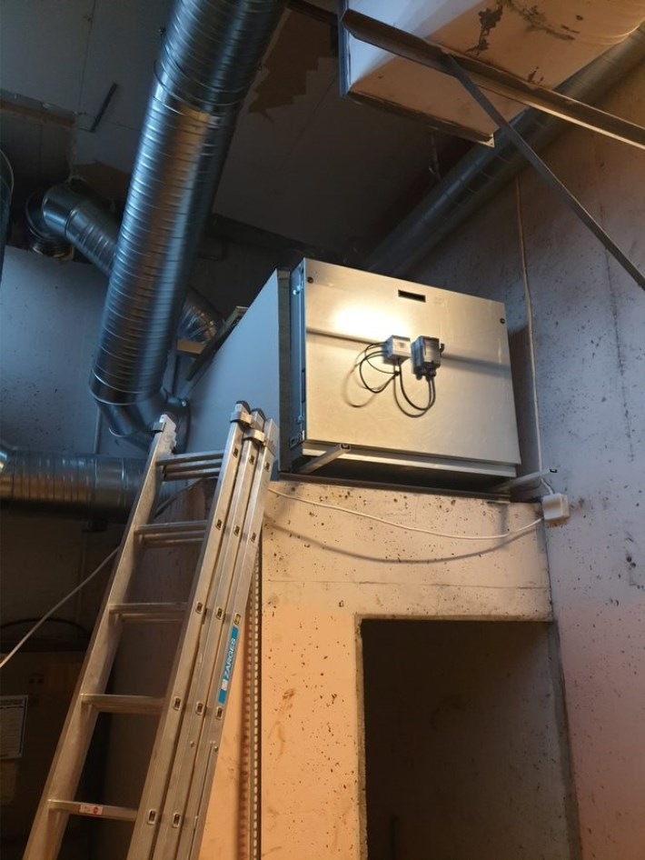

Etter flere befaringer av det eksisterende ventilasjonsannleget på Setra, sammen med Bryn Byggklima og Multiconsult er det kommet opp en plan for å forbedre ventilasjonsanleggene i 68 og 84  

## Hovseterveien 68

Da ventilasjonsanlegget for Hovseterveien 68 var fra byggeår(1975) ble det bestemt våren 2020 av styret at motorene/viftene i 68 skulle byttes ut. Før dette arbeidet var gjennomført oppstod det brann i ventilasjonsanlegget i sammenheng med leilighetsprosjektet. 

Etter brannen ble halve anlegget satt ut av drift. I sammenheng med brannen måtte også en del av rørene også byttes ut. Ventilasjonsanlegget i 68 er delt opp i to deler. Den delen som var ute av drift fikk byttet motor før jul 2020 og ble satt i full drift 05.01.2021.  

68B fikk startet ny  motor 15.01.2021.    Alle nye leiligheter i 68 har eget balansert system som ikke er koblet på anlegg som var i bygget fra  før.

Viftemotorene som ble montert er av typen XIC56R-1540 Radical. Disse er montert med filter og styringsenheter. De nye viftene er satt til å gå på 70% på dagtid og 50% på natterstid.

## Hovseterveien 84 generelt

Ventilasjonsanlegget for Hovseterveien 84 ble byttet ut i 1995. Her ble det anbefalt service av anlegget som er utført.

## Hovseterveien 84  Pizzeria og Hovstua

Her ble systemet byttet ut i 2021 til et balansert system

{}
