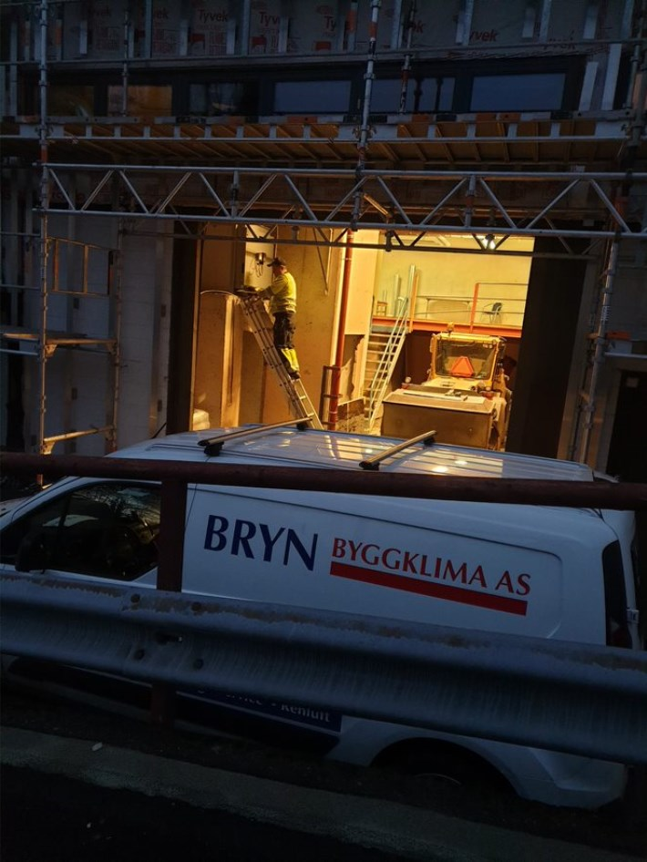
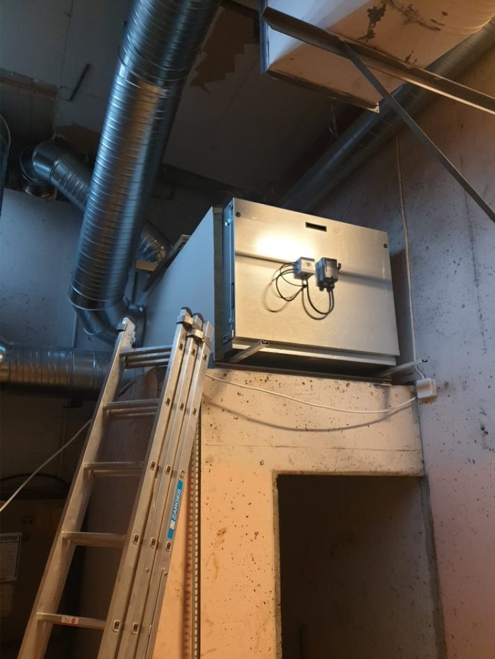
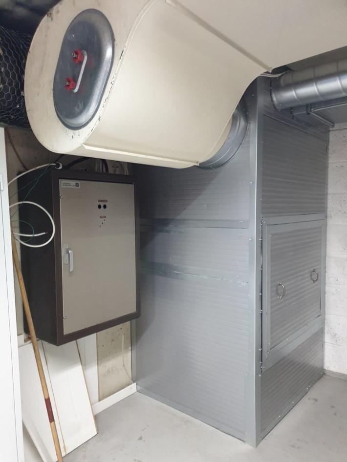

Etter flere befaringer av de eksisterende ventilasjonsanleggene, sammen med Bryn Byggklima og Multiconsult, ble det utarbeidet en plan for å forbedre anleggene i nr. 68 og 84.

## Hovseterveien 68

Ventilasjonsanlegget i Hovseterveien 68 var fra byggeåret 1975. Våren 2020 besluttet derfor styret at motorene og viftene skulle skiftes ut. Før arbeidet var gjennomført, oppsto det brann i ventilasjonsanlegget i forbindelse med leilighetsprosjektet.

Etter brannen ble halve anlegget satt ut av drift, og en del av rørene måtte skiftes ut. Ventilasjonsanlegget i nr. 68 er delt i to. Den delen som var ute av drift, fikk ny motor før jul 2020 og ble satt i full drift 5. januar 2021.

Den nye motoren i 68B ble startet 15. januar 2021. Alle de nye leilighetene i nr. 68 har egne balanserte ventilasjonssystemer som ikke er koblet til det opprinnelige anlegget.

Viftemotorene som ble montert, er av typen XIC56R-1540 Radical. De er utstyrt med filtre og styringsenheter. De nye viftene er satt til å gå med 70 % effekt på dagtid og 50 % om natten.

## Hovseterveien 84

Ventilasjonsanlegget i Hovseterveien 84 ble skiftet ut i 1995. Det ble anbefalt service på anlegget, og servicen er utført.

## Pizzeriaen og Hovstua i Hovseterveien 84

Systemet ble skiftet ut med et balansert ventilasjonssystem i 2021.

{}
